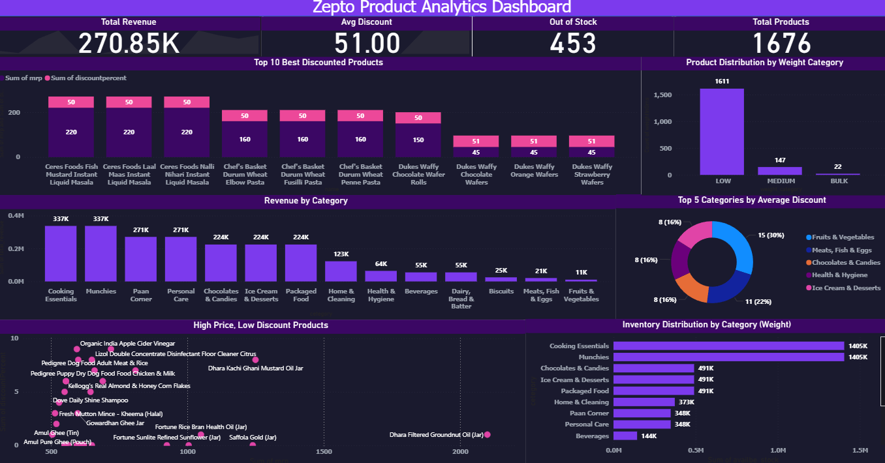

# Zepto-Product-Analytics-Dashboard
Power BI dashboard analyzing Zepto product data with revenue, discount, inventory, and category-wise performance insights using DAX and Power Query.

# 📊 Zepto Product Analytics Dashboard

## 🚀 Project Overview
This project focuses on analyzing Zepto product data using Power BI to uncover insights related to revenue, discounts, inventory management, and category performance. The dashboard provides interactive visualizations that help understand product trends and support data-driven decision-making.

## 🎯 Objectives
- Analyze product performance across categories.
- Identify top discounted products.
- Monitor inventory and out-of-stock products.
- Evaluate category-wise revenue contribution.
- Understand pricing and discount patterns.

## 🛠️ Tools & Technologies
- Power BI
- Excel
- Power Query
- DAX
- SQL

## 📈 Key Performance Indicators (KPIs)
- Total Revenue: 270.85K
- Average Discount: 51%
- Out of Stock Products: 453
- Total Products: 1,676

## 📊 Dashboard Features
### 1. Revenue Analysis
- Category-wise revenue performance.
- Identification of top revenue-generating categories.

### 2. Discount Analysis
- Top 10 best discounted products.
- Average discount distribution across categories.

### 3. Inventory Analysis
- Inventory distribution by category.
- Product distribution by weight category.
- Out-of-stock product tracking.

### 4. Product Performance Analysis
- Price vs Discount relationship.
- High-price, low-discount product identification.

## 💡 Key Insights
- Cooking Essentials generated the highest revenue.
- Fruits & Vegetables had the largest product count.
- Average discounts remained high across major categories.
- Several products were identified as out of stock, highlighting inventory management opportunities.

## 📷 Dashboard Preview



## 📂 Repository Structure

```text
Zepto-Product-Analytics-Dashboard
│
├── Dataset
│   └── zepto_sales.csv
│
├── Dashboard Screenshot
│   └── Zepto_Sales_Analytics_Dashboard.png
│
├── Power BI File
│   └── Zepto_Product_Analytics.pbix
│
└── README.md

## 🔍 Skills Demonstrated
- Data Cleaning & Transformation
- Data Visualization
- Dashboard Development
- Business Intelligence
- DAX Calculations
- Power Query
- Analytical Thinking

## 👨‍💻 Author
**Karlapudi Bhanu Prakash**

Aspiring Data Analyst skilled in Power BI, SQL, Excel, and Data Visualization.

---
⭐ If you found this project useful, feel free to star the repository.
